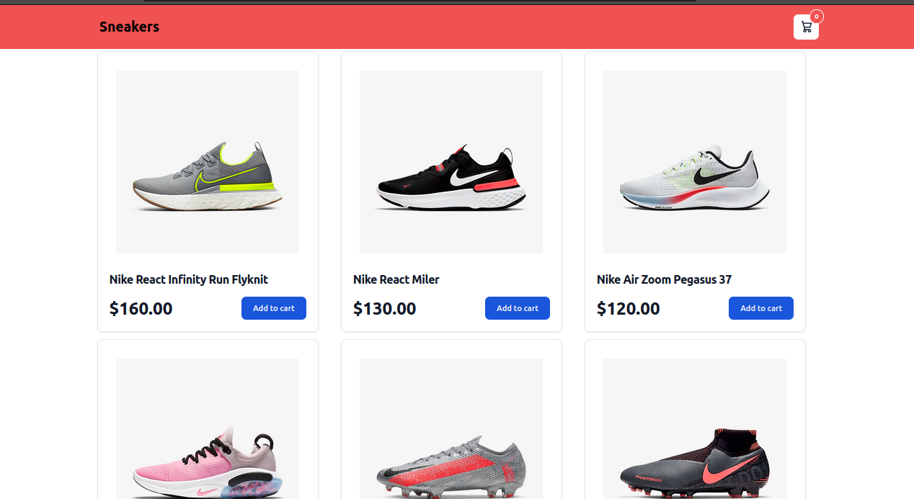
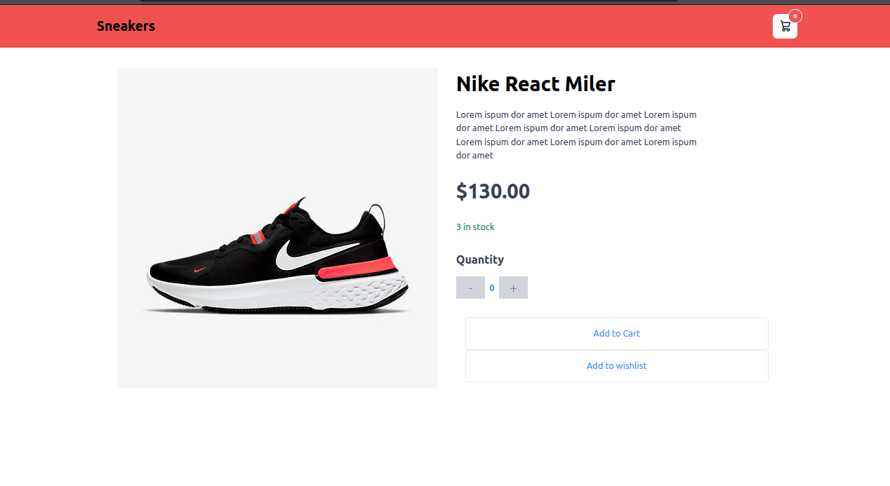
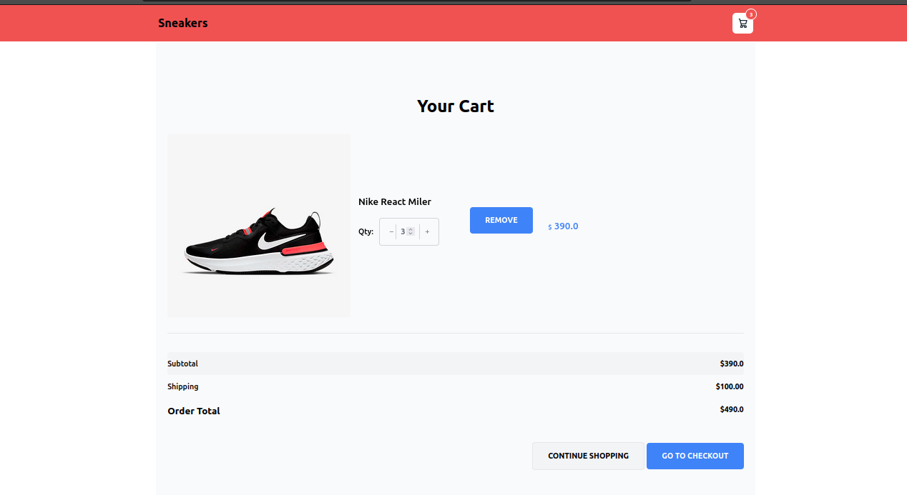

# Sneakers - Simple eCommerce Web App

Sneakers is a lightweight and user-friendly eCommerce web application. It allows users to browse products, add them to the cart, and make purchases. This README provides information on how to set up and use Sneakers.

## Table of Contents
- [Features](#features)
- [Screenshots](#screenshots)
- [Getting Started](#getting-started)
- [Usage](#usage)
- [Contributing](#contributing)

## Features

- Browse products by category.
- View detailed product information.
- Add products to the shopping cart.
<!-- - Checkout and make purchases securely. () -->
- Simple and intuitive user interface.

## Screenshots


*Caption: Home Page - Users can browse products by category.*


*Caption: Product Details - Detailed information about a selected product.*


*Caption: Shopping Cart - Users can view and manage items in their shopping cart.*


## Getting Started

To set up Sneakers on your local machine, follow these steps:

1. Clone the repository:

    ```bash
    git clone https://github.com/your-username/Sneakers.git
    cd Sneakers
    ```

2. Create a virtual environment and activate it:

    ```bash
    python -m venv venv
    source venv/bin/activate   # On Windows: .\venv\Scripts\activate
    ```

3. Install dependencies:

    ```bash
    pip install -r requirements.txt
    ```

4. Apply database migrations:

    ```bash
    python manage.py migrate
    ```

5. Load sample data (optional):

    ```bash
    python manage.py loaddata sample_data.json
    ```

6. Run the development server:

    ```bash
    python manage.py runserver
    ```

7. Open your browser and go to [http://localhost:8000](http://localhost:8000).

## Usage

1. Visit the Sneakers website.
2. Browse products by category.
3. Click on a product to view details.
4. Add products to your shopping cart.
5. Proceed to checkout to complete your purchase.

## Contributing

We welcome contributions! If you have suggestions or find issues, please create a GitHub issue or submit a pull request.

